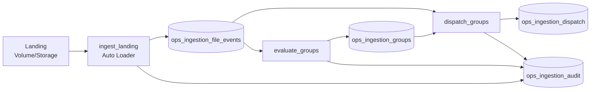

# Orquestrador de Ingestão (Databricks Community/Free + Delta Lake)

Projeto de engenharia de dados com foco em **orquestração de ingestão por arquivos** usando:

- PySpark
- Delta Lake
- Auto Loader
- Databricks Workflows (Jobs)
- Idempotência com `MERGE` e chaves determinísticas
- Auditoria e observabilidade operacional

## 1) Objetivo funcional

Entrada (nome de arquivo):

```text
SISTEMA=TJSP|TABELA=clientes|DT_REF=2026-04-14|PART=0001.json
SISTEMA=TJSP|TABELA=clientes|DT_REF=2026-04-14|MANIFEST.json
```

Regras implementadas:

1. Agrupar por `SISTEMA|TABELA|DT_REF`.
2. Disparar quando:
   - `received_parts >= expected_parts` (manifest), ou
   - timeout de 30 minutos.
3. Idempotência:
   - não contar PART duplicada,
   - não disparar grupo duas vezes.
4. Registrar auditoria técnica completa.

## 2) Arquitetura



## 3) Alinhamento com Databricks Community/Free Edition

Este repositório foi ajustado para execução **notebook-first/serverless**, que é o caminho mais estável na Free Edition:

- notebooks com bootstrap (`notebooks/00_free_edition_setup.py`);
- paths default em **Unity Catalog Volumes**;
- jobs no `databricks.yml` em `notebook_task` (sem `job_cluster` explícito);
- setup idempotente de `catalog/schema/volumes` no próprio notebook.

## 4) Como a idempotência funciona

### PART

- `file_business_key = sha256(group_key|PART|part_number_zero_padded)`
- escrita em `ops_ingestion_file_events` com `MERGE ON file_business_key`
- PART repetida gera `FILE_DUPLICATE_IGNORED`

### MANIFEST

- `file_business_key = sha256(group_key|MANIFEST|expected_parts_or_UNKNOWN)`
- manifest duplicado é ignorado
- conflito de expected_parts gera `MANIFEST_CONFLICT`
- política de grupo: **first-writer-wins** para `expected_parts`

### DISPATCH

- `dispatch_key = sha256(group_key)`
- `ops_ingestion_dispatch` usa `MERGE ON dispatch_key`
- rerun não cria novo dispatch (`GROUP_DISPATCH_SKIPPED_ALREADY_DONE`)

## 5) Como timeout foi implementado

- `first_seen_at`: menor `arrived_at` do grupo.
- `expires_at = first_seen_at + timeout_minutes` (default 30).
- se `OPEN` e `now >= expires_at` -> `READY` com `ready_reason = TIMEOUT`.
- `incomplete_flag = true` somente quando há `expected_parts` e faltam PARTs.

## 6) Estrutura do projeto

```text
.
├── README.md
├── databricks.yml
├── pyproject.toml
├── requirements-dev.txt
├── notebooks/
│   ├── 00_free_edition_setup.py
│   ├── 01_ingest_landing.py
│   ├── 02_evaluate_groups.py
│   ├── 03_dispatch_groups.py
│   ├── 10_generate_demo_files.py
│   └── 99_demo_run.py
├── src/ingestion_orchestrator/
│   ├── config.py
│   ├── parsing.py
│   ├── hashing.py
│   ├── logic.py
│   ├── audit.py
│   ├── schemas.py
│   ├── utils.py
│   ├── jobs/
│   ├── services/
│   └── sql/
├── tests/
└── sample_data/
```

## 7) Passo a passo detalhado (Databricks Community/Free)

### 7.1 Pré-requisitos

1. Workspace Databricks Free Edition ativo.
2. Permissão para criar objetos no `main` catalog.
3. Projeto importado no Workspace (Upload/Repo/Git Folder).

### 7.2 Importar projeto no Workspace

Exemplo de destino:

```text
/Workspace/Users/<seu-email>/teste-tecnico-bradesco
```

### 7.3 Rodar setup base (obrigatório)

Abra `notebooks/00_free_edition_setup.py` e execute.

Esse notebook:

- infere `project_root` automaticamente;
- cria (idempotente):
  - `main.ops_ingestion_dev` (schema),
  - volume `landing`,
  - volume `checkpoints`;
- seta variáveis de ambiente para os outros notebooks.

Widgets disponíveis:

- `env` (default `dev`)
- `catalog` (default `main`)
- `schema` (default `ops_ingestion_dev`)
- `group_timeout_minutes` (default `30`)
- `project_root` (auto, pode sobrescrever)

### 7.4 Gerar massa de demo no volume

Execute `notebooks/10_generate_demo_files.py`.

Isso cria cenários:

- grupo completo com manifest,
- grupo sem manifest,
- duplicidade de part,
- conflito de manifest.

### 7.5 Rodar pipeline manual

Na ordem:

1. `notebooks/01_ingest_landing.py`
2. `notebooks/02_evaluate_groups.py`
3. `notebooks/03_dispatch_groups.py`

Opcional: `notebooks/99_demo_run.py` executa tudo sequencialmente.

### 7.6 Validar resultados

No SQL Editor:

```sql
SELECT status, ready_reason, COUNT(*) AS groups
FROM main.ops_ingestion_dev.ops_ingestion_groups
GROUP BY 1,2
ORDER BY 1,2;

SELECT dispatch_reason, COUNT(*) AS total
FROM main.ops_ingestion_dev.ops_ingestion_dispatch
GROUP BY 1
ORDER BY 1;

SELECT event_type, severity, COUNT(*) AS total
FROM main.ops_ingestion_dev.ops_ingestion_audit
GROUP BY 1,2
ORDER BY 1,2;
```

### 7.7 Validar rerun idempotente

Rode novamente:

1. `02_evaluate_groups`
2. `03_dispatch_groups`

Esperado:

- não criar novo dispatch para grupo já processado;
- evento `GROUP_DISPATCH_SKIPPED_ALREADY_DONE` em audit.

### 7.8 Agendar como Job (UI) na Free Edition

Crie um Job com tarefas em cadeia:

1. `01_ingest_landing.py`
2. `02_evaluate_groups.py` (depends_on 1)
3. `03_dispatch_groups.py` (depends_on 2)

Configuração recomendada:

- serverless;
- `max concurrent runs = 1`;
- periodicidade de 1 a 5 minutos.

## 8) Execução com Databricks Bundle (opcional)

`databricks.yml` já está notebook-first para serverless.

```bash
databricks bundle validate -t dev
databricks bundle deploy -t dev
databricks bundle run -t dev orchestrator_demo_job
```

## 9) Tabelas Delta

- `ops_ingestion_file_events`
- `ops_ingestion_groups`
- `ops_ingestion_dispatch`
- `ops_ingestion_audit`

DDL disponível em: `src/ingestion_orchestrator/sql/ddl.sql`.

## 10) Eventos de auditoria

- `FILE_REGISTERED`
- `FILE_DUPLICATE_IGNORED`
- `MANIFEST_REGISTERED`
- `GROUP_CREATED`
- `GROUP_UPDATED`
- `GROUP_READY_ALL_PARTS`
- `GROUP_READY_TIMEOUT`
- `GROUP_DISPATCHED`
- `GROUP_DISPATCH_SKIPPED_ALREADY_DONE`
- `MANIFEST_CONFLICT`
- `PARSE_ERROR`

## 11) Testes e qualidade

```bash
python -m pytest
python -m ruff check .
python -m mypy src
```

## 12) Trade-offs

- Estratégia privilegia replay seguro e idempotência.
- `max_concurrent_runs=1` simplifica concorrência no fechamento/disparo.
- Política de manifest (`first-writer-wins`) evita sobrescrita instável.

## 13) Limitações e próximos passos

- Free Edition é ótima para POC e demonstração técnica.
- Para produção corporativa: migrar para plano com SLA, segurança/operação enterprise e governança avançada.

## 14) Estratégia de branches (GitHub)

Modelo recomendado (já preparado para CI/CD neste repositório):

- `develop` -> ambiente `dev`
- `homol` -> ambiente `homol`
- `main` -> ambiente `prod`

Fluxo sugerido:

1. criar feature branch a partir de `develop`;
2. abrir PR para `develop` (CI valida);
3. promover de `develop` para `homol` via PR;
4. promover de `homol` para `main` via PR com aprovação.

## 15) CI/CD GitHub Actions

Workflows criados:

- `.github/workflows/ci.yml`
  - roda em `push` e `pull_request` para `develop`, `homol`, `main`
  - executa `ruff`, `mypy`, `pytest`

- `.github/workflows/cd-dev.yml`
  - roda em `push` para `develop`
  - `databricks bundle validate -t dev`
  - `databricks bundle deploy -t dev`

- `.github/workflows/cd-homol.yml`
  - roda em `push` para `homol`
  - `databricks bundle validate -t homol`
  - `databricks bundle deploy -t homol`

- `.github/workflows/cd-prod.yml`
  - roda em `push` para `main`
  - `databricks bundle validate -t prod`
  - `databricks bundle deploy -t prod`

## 16) Secrets necessários no GitHub

No repositório, configure os seguintes secrets:

- `DATABRICKS_HOST_DEV`
- `DATABRICKS_TOKEN_DEV`
- `DATABRICKS_HOST_HOMOL`
- `DATABRICKS_TOKEN_HOMOL`
- `DATABRICKS_HOST_PROD`
- `DATABRICKS_TOKEN_PROD`

Recomendação:

- usar GitHub Environments `dev`, `homol`, `prod`;
- exigir aprovação manual no environment `prod`.

## 17) Evidências de execução (capturas da validação manual)

As capturas da execução em Databricks (rodadas em `ops_ingestion_dev`) comprovam:

1. **Jobs criados manualmente**
   - `ingestion-orchestrator-dev-demo-manual`
   - `ingestion-orchestrator-dev-ingest-manual`
   - `ingestion-orchestrator-dev-evaluate-manual`
   - `ingestion-orchestrator-dev-dispatch-manual`

2. **Execução ponta a ponta bem-sucedida**
   - Run do job `ingestion-orchestrator-dev-demo-manual` com tasks:
     - `generate_demo_files` -> `Succeeded`
     - `ingest` -> `Succeeded`
     - `evaluate` -> `Succeeded`
     - `dispatch` -> `Succeeded`

3. **Comportamento idempotente em rerun**
   - Na execução mostrada, o `ingest` retornou `raw_events: 0`, `inserted: 0`, `duplicates: 0`.
   - O `dispatch` retornou `ready_groups: 0`, `dispatched: 0`, `skipped_already_dispatched: 0`.
   - Esse comportamento é esperado quando o pipeline é executado novamente sem novos arquivos elegíveis.

4. **Estado de grupos e dispatch**
   - `TJSP|clientes|2026-04-14` aparece como `DISPATCHED` com `ready_reason = ALL_PARTS`.
   - Tabela de dispatch contém `dispatch_reason = ALL_PARTS` para esse grupo.

5. **Auditoria operacional**
   - Contagem de eventos mostra:
     - `FILE_DUPLICATE_IGNORED = 7`
     - `MANIFEST_CONFLICT = 1`
   - Isso confirma tratamento de duplicidade e registro de conflito de manifest.

> Observação: a evidência de `TIMEOUT` pode não aparecer em execuções imediatas de rerun, pois depende da janela temporal (`group_timeout_minutes`).
